# Análise de Sentimentos com Language Studio no Azure AI.

PASSOS:

## Comece com a fala.

[What is speech to text?](https://learn.microsoft.com/en-us/azure/ai-services/speech-service/speech-to-text)

[Sample Repository for the Microsoft Cognitive Services Speech SDK](https://github.com/Azure-Samples/cognitive-services-speech-sdk)

[What is the Speech CLI?](https://learn.microsoft.com/en-us/azure/ai-services/speech-service/spx-overview)

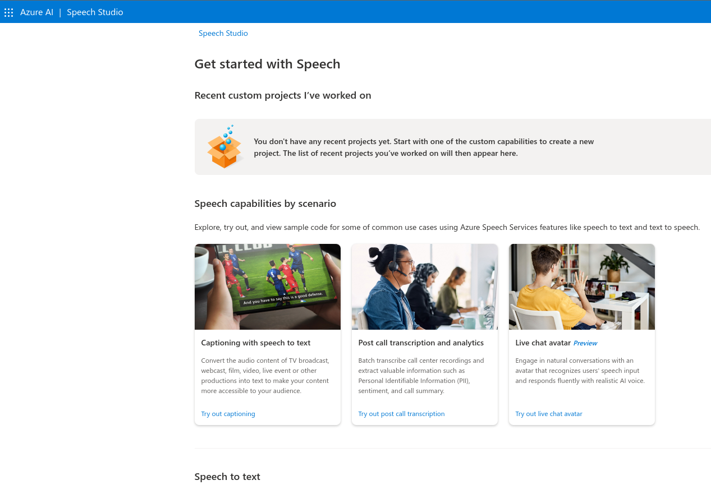

## Fala em tempo real para texto

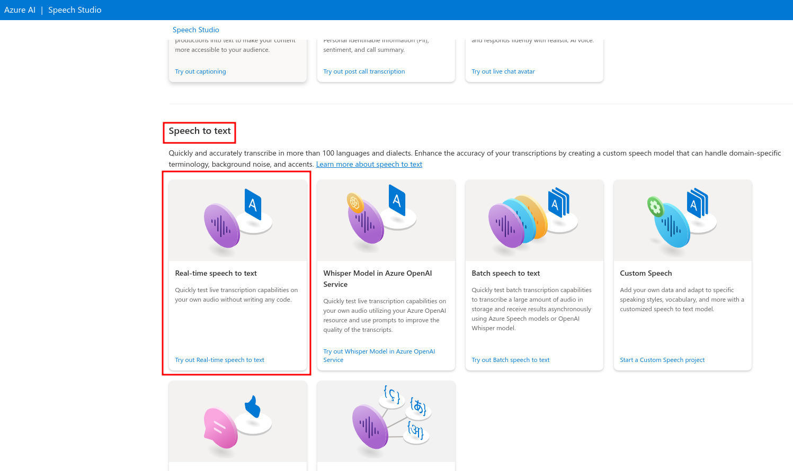

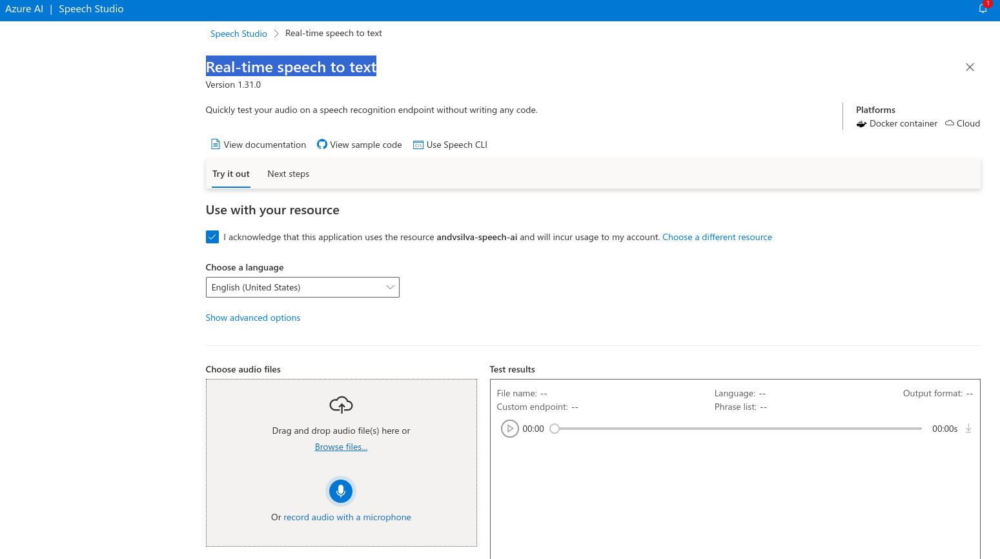

## Executar - Trabalho

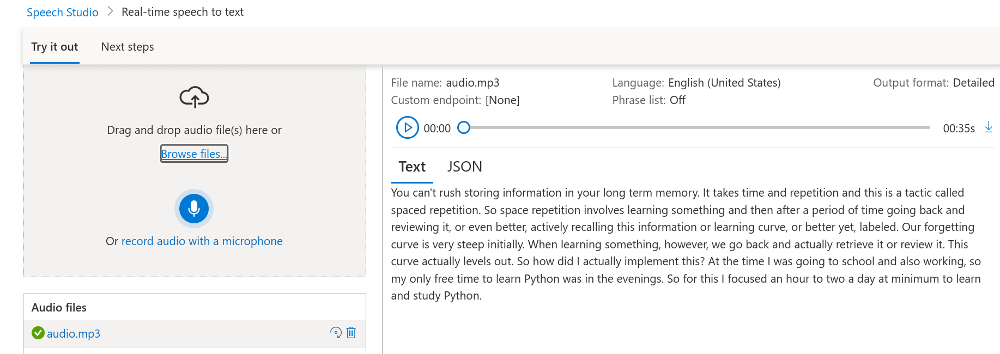

### Próximos passos:

#### Comece!

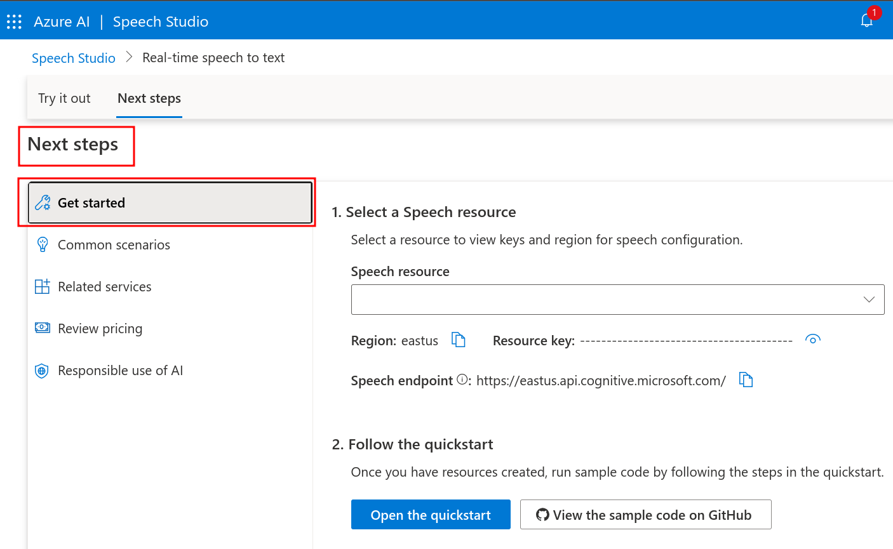

#### Cenários

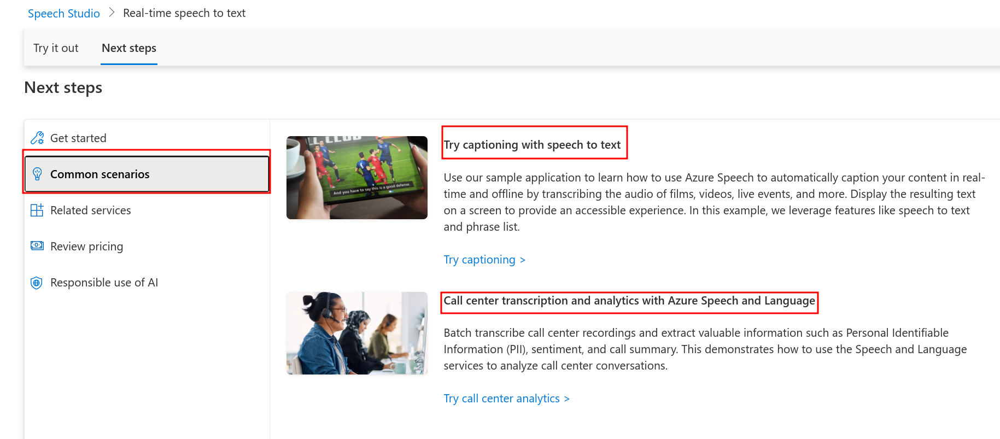

#### Serviços Relacionados

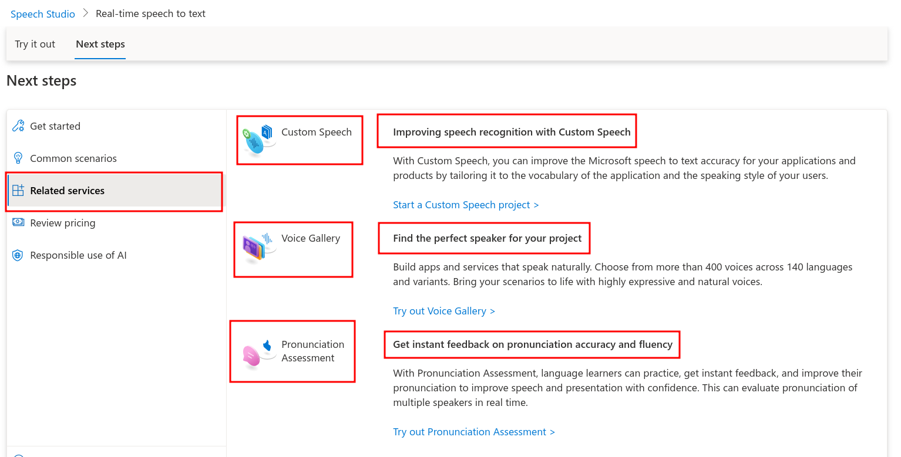

#### Preços

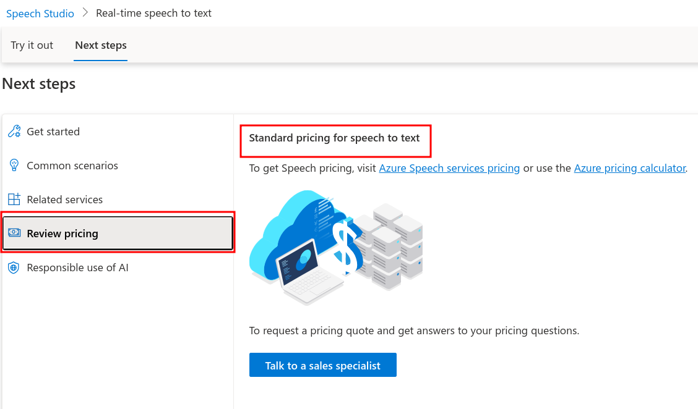

#### Uso Responsável da IA

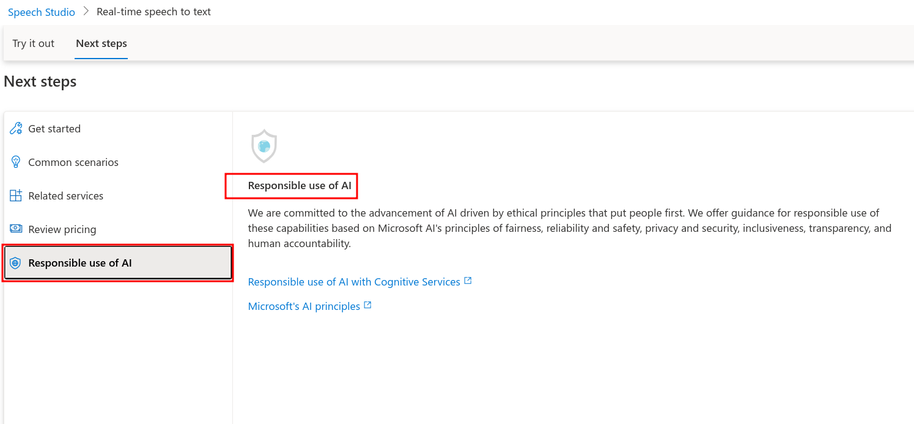

## Conhecendo A Language Studio

Link: [https://portal.azure.com/#create/hub](https://portal.azure.com/#create/hub)

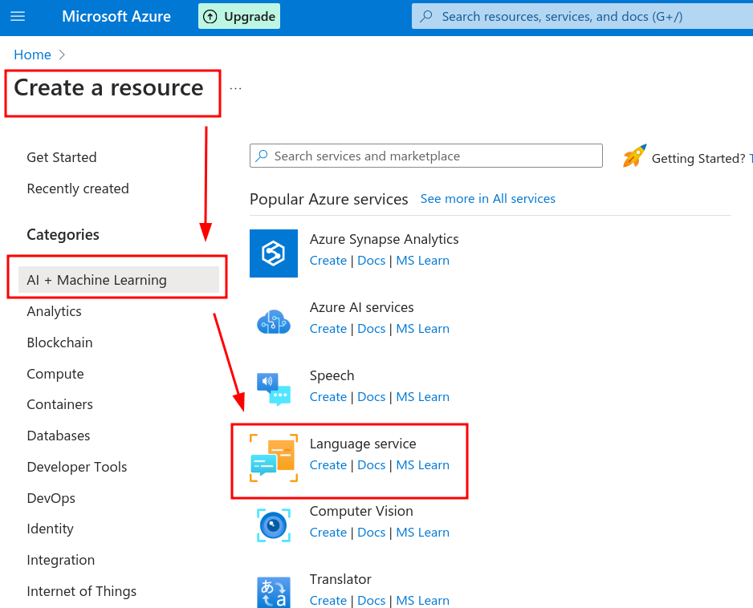

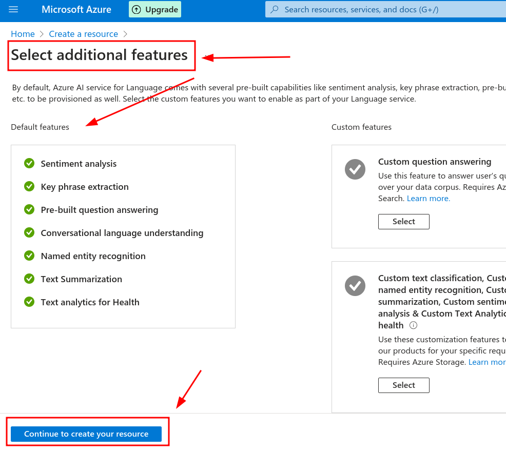

Link: [https://language.cognitive.azure.com/home](https://language.cognitive.azure.com/home)

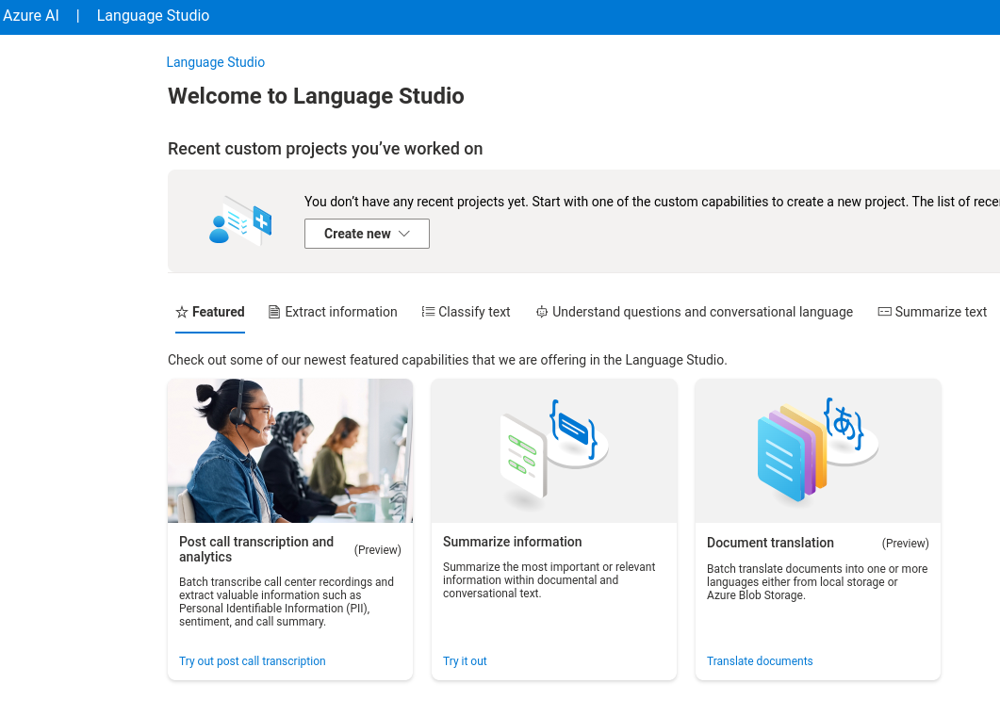

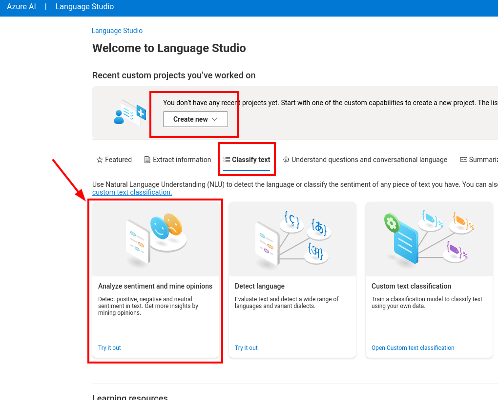

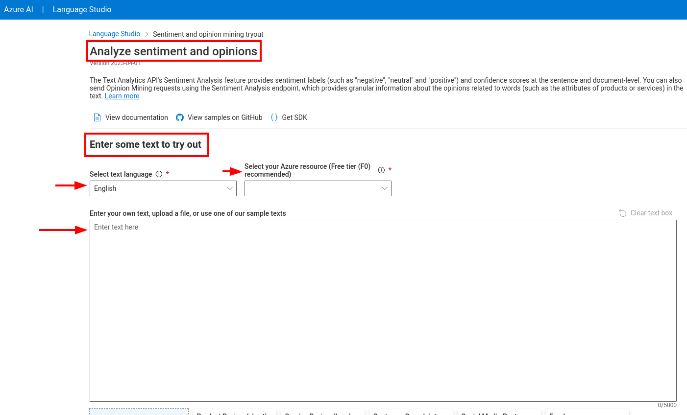

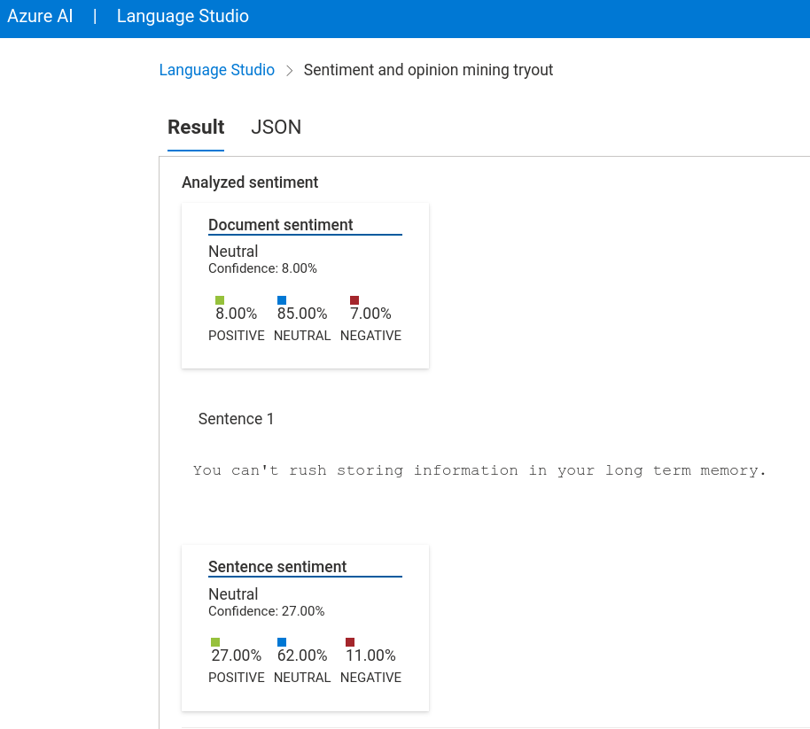

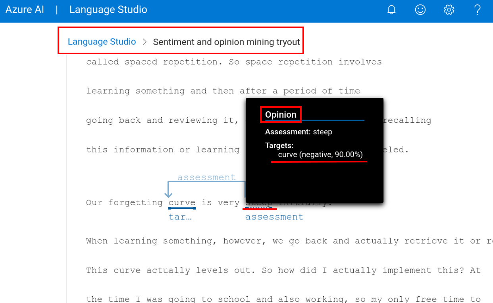

Links Importantes:
- [Explore Speech Studio](https://microsoftlearning.github.io/mslearn-ai-fundamentals/Instructions/Labs/09-speech.html)
- [Analyze text with Language Studio](https://microsoftlearning.github.io/mslearn-ai-fundamentals/Instructions/Labs/06-text-analysis.html)
